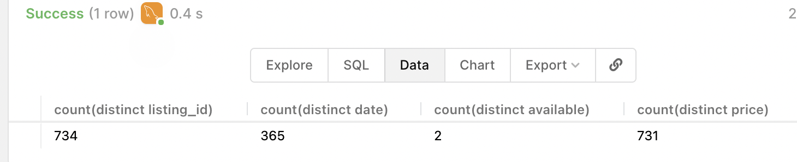
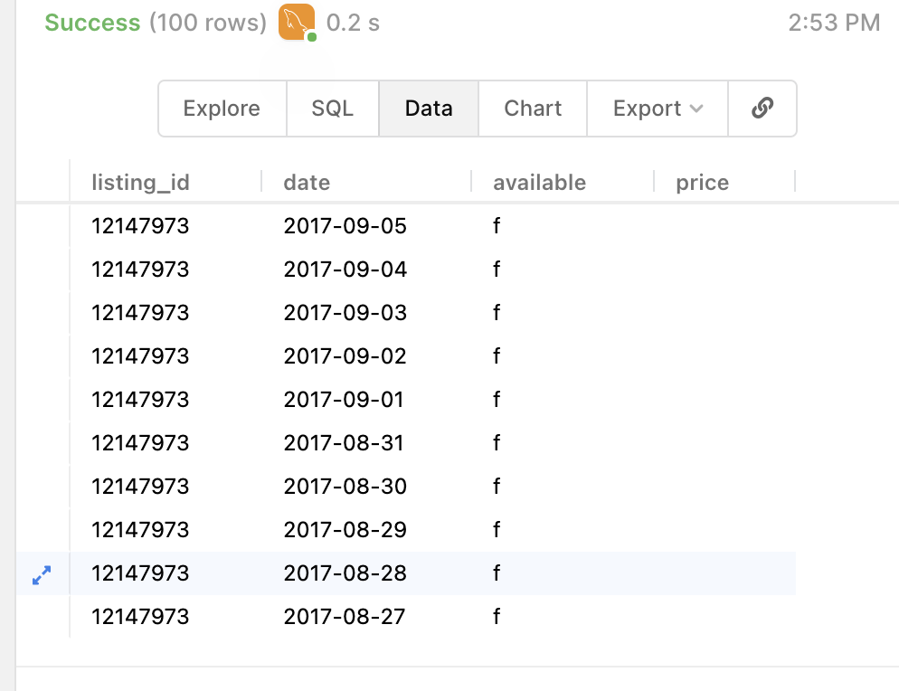
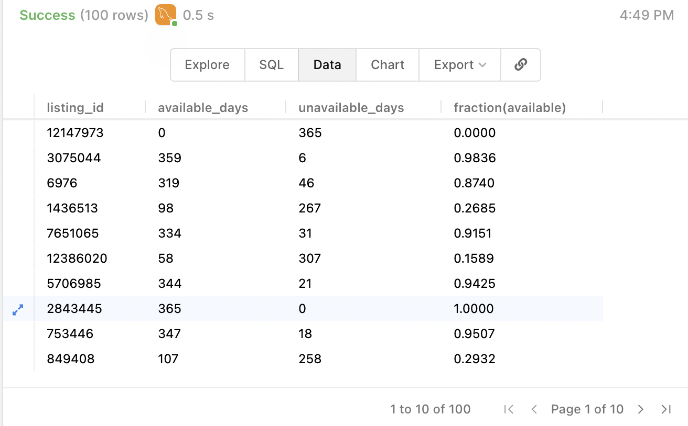
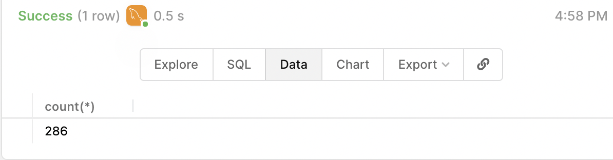

SQL assignment:

(f and t mean false and true, respectively)

Please share query and output for each:

Questions:

1. What is the time period used?
  
```sql
select MIN(date), MAX(date) from airbnb_calendar;
```


2. How many properties have duplicate entries? Remove duplicate rows (say a row appears 3 times, remove 2 and keep 1)

```sql
select count(distinct listing_id), count(distinct date), count(distinct available), count(distinct price) from airbnb_calendar;
```



```sql
SELECT distinct listing_id,date,available,price FROM airbnb_calendar;
```


3. For each property, find out the number of days the property was available and not available (create a table with listing_id, available days, unavailable days and available days as a fraction of total days)

```sql
select listing_id, sum(CASE WHEN available = 't' THEN 1 ELSE 0 END) as available_days, count(available)-sum(CASE WHEN available = 't' THEN 1 ELSE 0 END)  as unavailable_days, sum(CASE WHEN available = 't' THEN 1 ELSE 0 END)/count(available) as "fraction(available)" from airbnb_calendar group by listing_id;
```


4. How many properties were available on more than 50% of the days? How many properties were available on more than 75% of the days?

```sql
select count(*) from (select listing_id, sum(CASE WHEN available = 't' THEN 1 ELSE 0 END)/count(available) as fraction_avail from airbnb_calendar group by listing_id having fraction_avail > 0.5) as alias_table;
```


```sql
select count(*) from (select listing_id, sum(CASE WHEN available = 't' THEN 1 ELSE 0 END)/count(available) as fraction_avail from airbnb_calendar group by listing_id having fraction_avail > 0.75) as alias_table;
```


5. Create a table with max, min and average price of each property

```sql
select listing_id, max(price), min(price), avg(price) from airbnb_calendar group by listing_id;
```


6. Extract properties with an average price of more than $500

```sql
select listing_id, avg(price) as average from airbnb_calendar group by listing_id having average>500;
```
